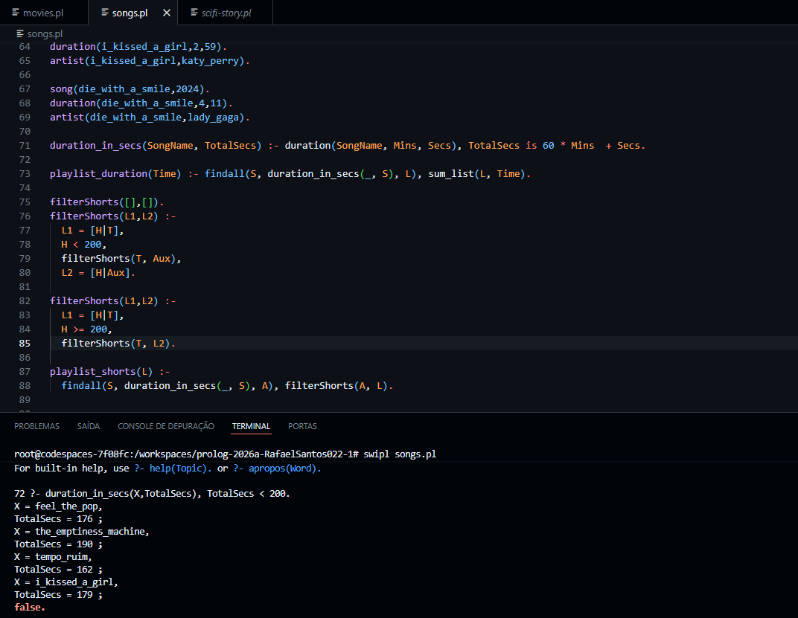

Parte teórica

Processo de execução de consultas em Prolog

Como funciona:
- Procura uma regra ou fato compatível
- Faz a unificação, ajustando as variáveis para encaixar a consulta com a regra ou fato encontrado.
- Resolve as condições da regra na ordem da esquerda pra direita.
- Explora um caminho até o fim (depth-first).
- Se falhar, volta e tenta outro caminho.
- Retorna o resultado, se encontrar uma solução mostra os valores, se não, retorna false.

Pontos que entendi melhor:
1. Ordem de execução:
    - Prolog segue um caminho até o fim, se der errado volta para o último lugar onde havia mais de uma possibilidade
      e testa outro caminho.

2. O objetivo do Prolog:
    - Tentar provar que a consulta é verdadeira a partir da base de conhecimento.

Parte prática:

Exercício 1:

Exercício 2:

Exercício 3:

Exercício 4:

Referências:
https://lpn.swi-prolog.org/lpnpage.php?pagetype=html&pageid=lpn-htmlse1
